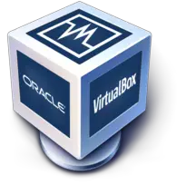
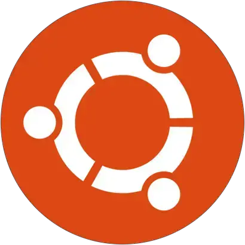

# Deliverable 1

## Concepts I don't understand
* Apache
* Init System
* Apache Profiles
* Ubuntu Server

## What is a web server? Hardware and Software side
When it comes to hardware a web server is a computer that stores web server software and a websites component files.

## What are different web server applications?
| Application Name | License | Projects Website |
|------------------|---------|------------------|
| Apache           |Apache License 2.0|https://httpd.apache.org/
| Nginx            |BSD License| https://www.nginx.com/
| Lighttpd         |BSD License|https://www.lighttpd.net/

## Apache

Apache is a open-source HTTP server for modern operating systems that is used for accepting HTTP requests from internet users and sending them their desired information in the form of files and web pages.

## Nginx

Nginx is a open source software that can be used for web serving,reverse proxying caching load balancing media streaming and more and focuses on have the fastest performance as possible.

## Lighttpd

Lighttpd is a open source web server optimized for speed critical environments while remaining standards-compliant secure and flexible.
## What is Virtualization?
a technology that allows you to create virtual versions of something.

## What is Virtualbox?

Virtual box is a hypervisor that can be installed on windows, linux, macOS and more.

## What is a virtual machine?
A virtual computer that is dependent on software rather then physical hardware.

## What is Ubuntu Server?

A simple and convenient way to set up a simple home network.

## What is a Firewall?
a network security device that monitors incoming and outgoing network traffic.

## What is SSH?
SSH or Secure Shell is a network protocol that gives users, particularly system administrators a secure way to access the computer over an unsecured network.
