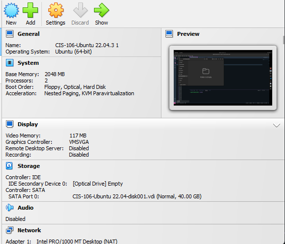

# What are the server hardware specifications?

## What is Ubuntu server log in screen?

## What is the IP address of your Ubuntu Server Virtual Machine?
192.168.1.31
## How do you enable Ubuntu Firewall?
sudo ufw enable
## How do you check if the Ubuntu Firewall is running?
sudo ufw status
## How do you disable the Ubuntu Firewall?
sudo ufw disable
## How do you add Apache to the Firewall?
sudo ufw allow 'Apache'
## What is the command you used to install Apache?
sudo apt install apache2 
## What is the command you use to check if Apache is running?
systemctl status apache2 --no-pager
## What is the command you use to stop Apache?
systemctl stop apache2
## What is the command you use to restart Apache?
systemctl restart apache2
## What is the command used to test Apache configuration?
sudo apache2ctl configtest
## What is the command used to check the installed version of Apache?
apache2 -v
## What are the most common commands to troubleshoot Apache errors?
systemctl,journalctl and apachectl 
systemctl is used to check the status and start,restart or stop the apache service it is used like:
systemctl status apache2 --no-page checks the status of apache and prints to the screen no pager allows it to do it without having to interact at all
systemctl start apache2 used to start apache

Journalctl is used to check apache logs and is used like:
sudo journalctl -u apache2.service --since today --no-pager this prints the logs for the apache service that happened today

Lastly, apachect1 is used to troubleshoot configurations for your apache server and to test them and it is used:
sudo apachect1 configtest runs the apache config file to make sure that everything is good to go if so it will say Syntax Ok if not it will tell you where the error is.
## Which are Apache Log Files, and what are they used for?
Apache log files are a resource where any errors related to configuration,built in modules and other debugging information are input and it is used for troubleshooting any errors that you have with a browser or another HTTP client it will have entry's that look like this:
