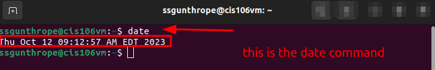
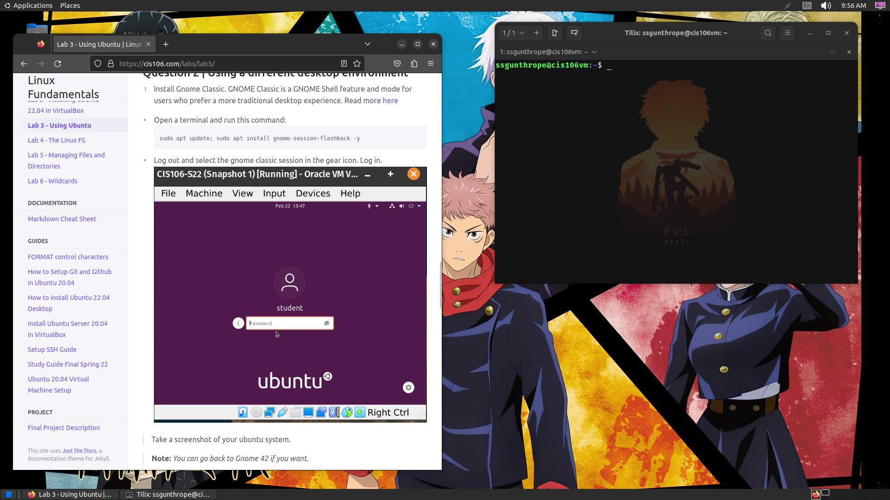

# Lab 3 

## Question 1 

## Question 2

## Question 3
| Program purpose     | Package Name    | Version   |
| ------------------- | --------------- | --------- |
| Play a tetris game  | block attack    | 2.7.0-1   |
| Play a video file   | Dragon Player   | 4:21.12.3 |
| Browse the internet | epiphanybrowser | 42.4      |
| Read your email     | aerc            | 0.8.2-1   |
| Play music          | Clementine      | 1.4.0     |
 
## Question 4
| command | what it does                                                 |
| ------- | ------------------------------------------------------------ |
| echo    | displays a line of text                                      |
| fortune | prints random text                                           |
| cowsay  | prints a ASCII image of a cow saying what the user has typed |
| lolcat  | adds rainbow coloring to text                                |
| figlet  | displays large text with screen characters                   |
| toilet  | displays large colorful characters                           |
| rig     | makes a random identity with name address etc                |
