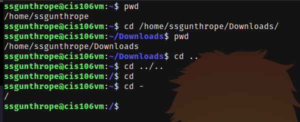
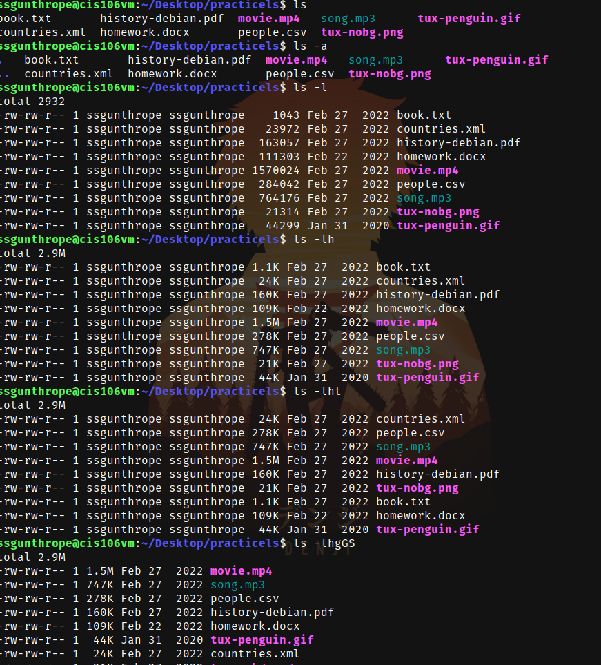
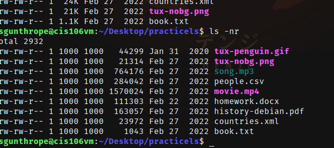
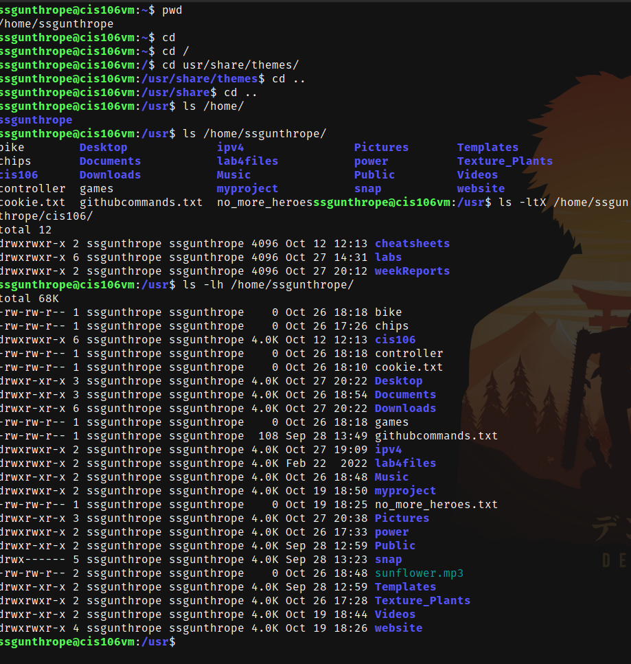
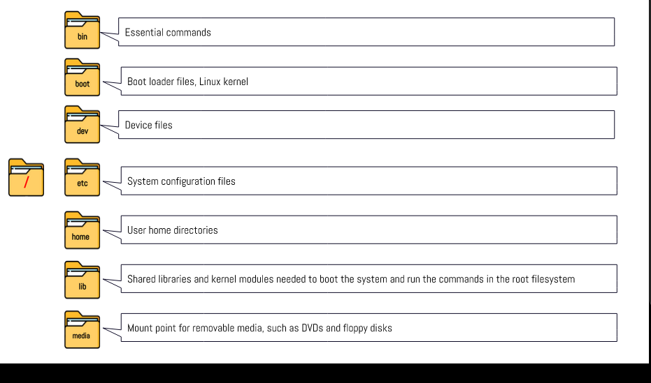
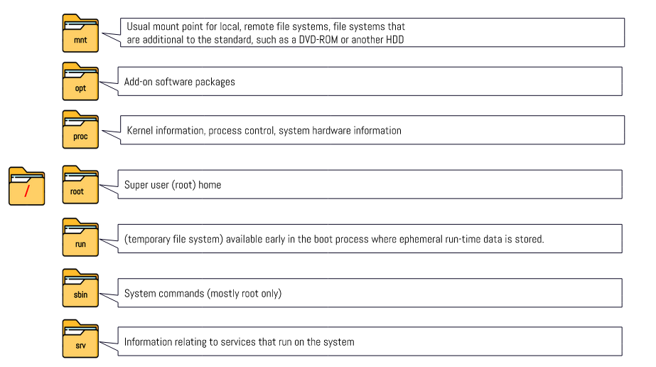
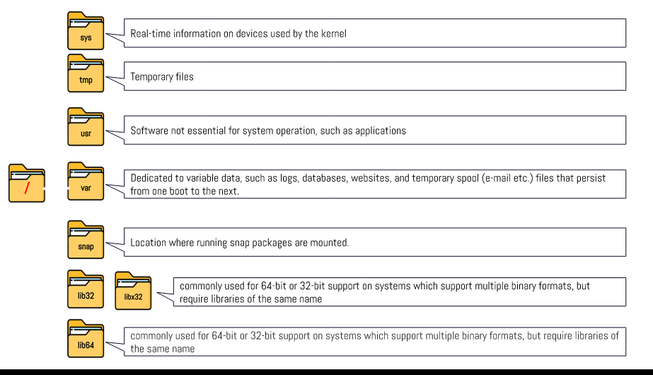

# Week Report 4

## Practice from the presentation the linux file system

## The Linux file system directories and their purpose

## All the commands for navigating the file system
| Command | What it does                                      | Syntax | Example |
| ------- | ------------------------------------------------- | ------ | ------- |
| pwd     | prints current directory                          | pwd    | pwd     |
| cd      | allows you to move your current directory         | ls     | ls      |
| ls      | allows you to look at files inside of directories | cd     | cd      |

## Basic Terminology 
**File System:** the way files are stored and organized.
**Current Directory:** the directory where you are currently in the file system.
**Parent Directory:** the folder above all subfolders.
**difference between home directory and your home directory**: your home directory is a directory that you have full permissions in while the home directory access is allow given to admins.
**Pathnames:** the location of a file.
**RelativePath:** the location starting from the current working directory.
**AbsolutePath:** The location of a file starting from the root.