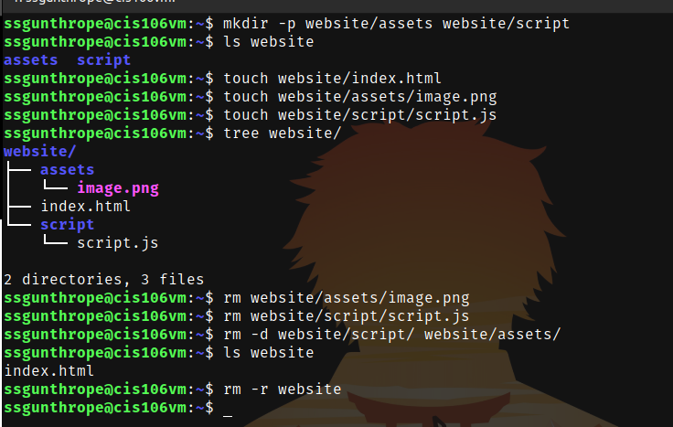
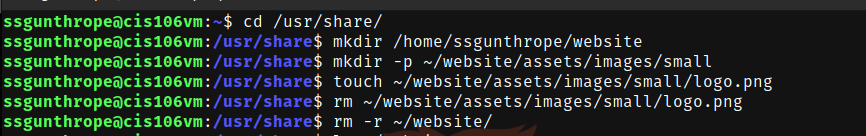
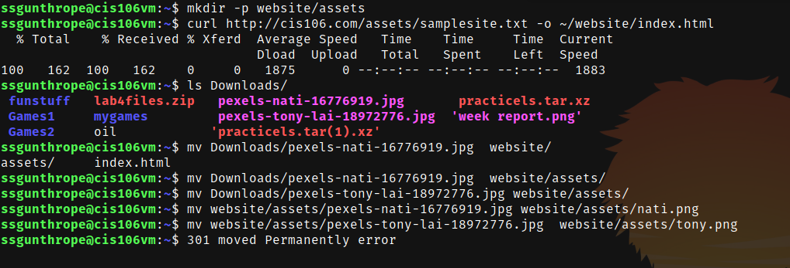
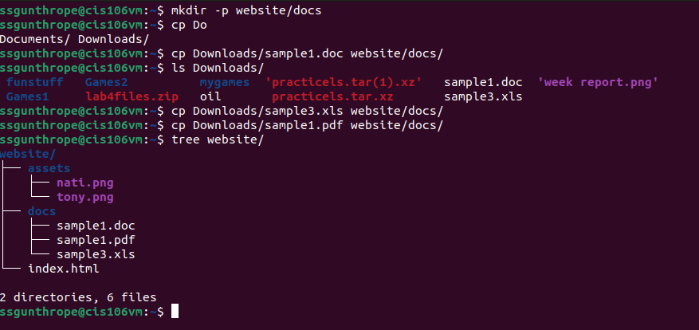

# Week Report 5 

## What are command options?
Command options are options that modify or enhance a command.

## What are command arguments?
Arguments are what the command acts on or does something to.

## What command is used for creating directories?
mkdir is used 3 examples of using it are:
mkdir linux
mkdir -p chips/cookies chips
mkdir /home/ssgunthrope/flowers

## What Does the touch command do?
The touch command is used to create files examples are:
touch chips
touch /home/ssgunthrope/chips
touch chips.txt

## How do you remove a file?
To remove a file you have to use the rm command like so:
rm chips.txt

## How do you remove a directory and can you remove non empty directories in Linux?
To remove a directory it is done with the rm command however you have to use options to remove a directory the command rm -d will remove a directory that is empty and to remove a directory that is not empty you have to use rm -r.

## Explain the mv and cp command
The mv command is used to rename or move directories and files examples of using it to rename are mv chips cookies and examples of moving files are mv chips Downloads/ this moves the file from home to downloads.

The cp command is used to copy files from a source to a destination examples of it are: cp Downloads/oil.txt Documents/ 

## Practice 1

## Practice 2

## Practice 3

## Practice 4
