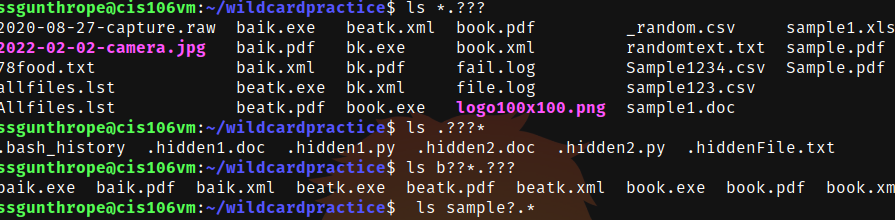

## The * wildcard
This wildcard  matches anything for any number of characters.
Examples:
ls *cookie.txt list all files that end with cookie.txt
ls *.py shows all files that end in py
ls apple* shows all files that begin with apple

## Practice 5

## THE ? wildcard 
 The ? wildcard matches one character.
 Examples:
 ls .??? shows files with extensions that are 3 characters
 ls ??? shows files that are 3 characters or more

## Practice 6

 ## the [] wildcard
  [] wild card is used to to match a single character in range and can be reversed using the ! character
  Examples:
  ls [0-9]* shows all files that begin with a number
  ls *[A-Z] shows all files the end with a capital letter
  ls [a-z]*.?? shows all files that start with a lowercase letter and has two characters as their file extension.

  ## Practice 7
  

  ## Brace Expansion
A feature of bash that allows you to generate arbitrary strings.
Examples:
touch chips{1-4}.txt creates 4 files that begins with chip and is a text file
echo{7..2} counts down from 7 to 2 and displays it
rm [file1,file2,file3] deletes files 1-3